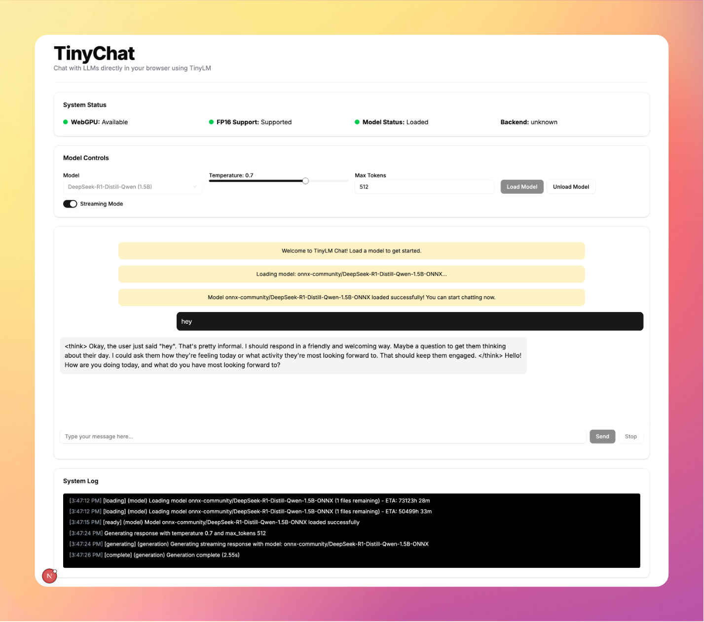
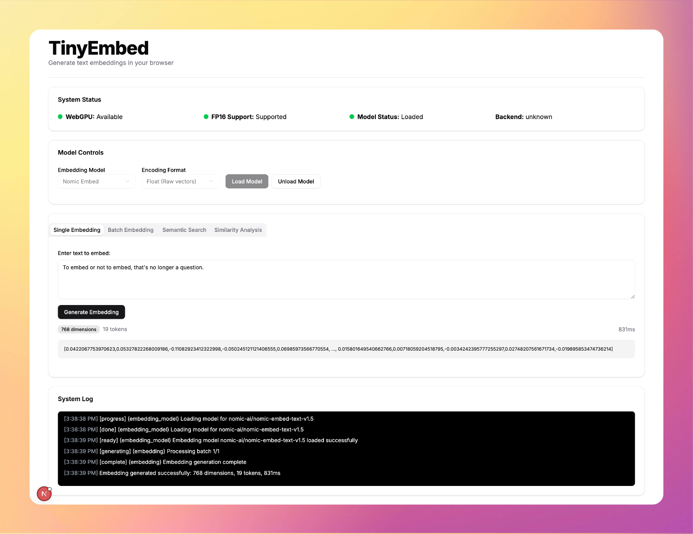
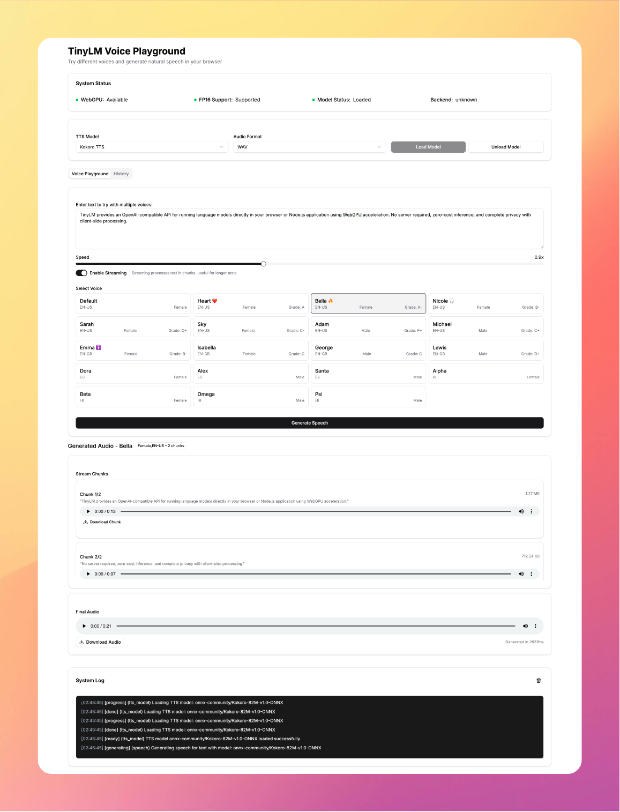

<div align="center">
  <h1> TinyLM </h1>
  <p> Browser based ML Inference </p>
  <p> Run DeepSeek, Llama3.2, Nomic Embed and more right inside your browser </p>
  <p>
    <a href="https://github.com/wizenheimer/tinylm/tree/main/examples"><strong>Examples </strong> </a> |
    <a href="https://github.com/wizenheimer/tinychat"><strong> TinyChat </strong> </a> |
    <a href="https://github.com/wizenheimer/tinyembed"><strong> TinyEmbed </strong> </a> |
    <a href="https://github.com/wizenheimer/tinysonnet"><strong> TinySonnet </strong> </a>
  </p>
</div>


## Features

- **OpenAI-compatible API** - Simple drop-in alternative for OpenAI client libraries
- **Client-side Inference** - Run zero-cost inference client side using WebGPU
- **Text Generation** - Generate high-quality text with controllable parameters
- **Text Embeddings** - Create semantic embeddings for search, clustering, and similarity
- **WebGPU Acceleration** - Automatic detection and use of WebGPU when available
- **Cross-Platform** - Works in both browser and Node.js environments
- **True Streaming** - Real-time token streaming with low latency
- **Detailed Progress Tracking** - Per-file download tracking with ETA and speed metrics
- **Interruption Support** - Ability to stop generation mid-way
- **Memory Management** - Explicit model offloading for memory efficiency
- **TypeScript Support** - Fully typed API with exported type definitions

## Installation

```bash
npm install tinylm
# or
yarn add tinylm
```

## Basic Usage

### Quick Start - Text Generation

```javascript
import { TinyLM } from "tinylm";

// Create a TinyLM instance
const tiny = new TinyLM();

// Initialize and load a model
await tiny.init({
  models: ["HuggingFaceTB/SmolLM2-135M-Instruct"],
});

// Generate a completion
const response = await tiny.chat.completions.create({
  messages: [
    { role: "system", content: "You are a helpful AI assistant." },
    { role: "user", content: "What is artificial intelligence?" },
  ],
  temperature: 0.7,
  max_tokens: 100,
});

console.log(response.choices[0].message.content);
```



Source: [Fork Me](https://github.com/wizenheimer/tinychat)

### Text Embeddings Example

```javascript
import { TinyLM } from "tinylm";

const tiny = new TinyLM();
await tiny.init({
  embeddingModels: ["nomic-ai/nomic-embed-text-v1.5"],
});

// Generate embeddings for text
const embedding = await tiny.embeddings.create({
  model: "nomic-ai/nomic-embed-text-v1.5",
  input: "Your text string goes here",
});

console.log(`Embedding dimensions: ${embedding.data[0].embedding.length}`);
console.log(`Token usage: ${embedding.usage.prompt_tokens} tokens`);

// Generate embeddings for multiple texts at once
const batchEmbeddings = await tiny.embeddings.create({
  model: "nomic-ai/nomic-embed-text-v1.5",
  input: [
    "First document to embed",
    "Second document to embed",
    "Third document with different content",
  ],
});

console.log(`Generated ${batchEmbeddings.data.length} embeddings`);
```



Source: [Fork Me](https://github.com/wizenheimer/tinyembed)

### Streaming Example

```javascript
import { TinyLM } from "tinylm";

const tiny = new TinyLM();
await tiny.init();
await tiny.models.load({ model: "HuggingFaceTB/SmolLM2-135M-Instruct" });

// Generate a streaming response
const stream = await tiny.chat.completions.create({
  messages: [
    { role: "system", content: "You are a creative storyteller." },
    { role: "user", content: "Write a short poem about technology." },
  ],
  temperature: 0.9,
  max_tokens: 200,
  stream: true, // Enable streaming
});

// Process the stream
for await (const chunk of stream) {
  const content = chunk.choices[0]?.delta?.content || "";
  process.stdout.write(content); // Display content as it arrives
}
```

### Audio Generation



Source: [Fork Me](https://github.com/wizenheimer/tinysonnet)

### Text to Speech Example

```javascript
import { TinyLM } from "tinylm";

const tiny = new TinyLM();

const audio = await tiny.audio.speech.create({
  model: "onnx-community/Kokoro-82M-v1.0-ONNX",
  voice: "af_bella",
  input: "Today is a wonderful day to build something people love!",
});
```

## API Reference

### `TinyLM` Class

#### Constructor

```javascript
const tiny = new TinyLM({
  progressCallback: (progress) => console.log(progress),
  progressThrottleTime: 100,
});
```

Options:

- `progressCallback`: Function called with progress updates
- `progressThrottleTime`: Milliseconds between progress updates (default: 100)

#### `init(options)`

Initialize TinyLM with optional model preloading.

```javascript
await tiny.init({
  models: ["HuggingFaceTB/SmolLM2-135M-Instruct"], // Text generation models to preload
  embeddingModels: ["Xenova/all-MiniLM-L6-v2"], // Embedding models to preload
  lazyLoad: true, // Don't load models immediately (default: false)
});
```

### Chat Completions API

#### `chat.completions.create(options)`

Generate text completions with an OpenAI-compatible interface.

```javascript
const response = await tiny.chat.completions.create({
  messages: [
    { role: "system", content: "You are a helpful AI assistant." },
    { role: "user", content: "What is artificial intelligence?" },
  ],
  model: "HuggingFaceTB/SmolLM2-135M-Instruct", // Optional if already loaded
  temperature: 0.7,
  max_tokens: 100,
  do_sample: true,
  top_k: 40,
  top_p: 0.95,
  stream: false, // Set to true for streaming
});
```

Returns:

- When `stream: false`: A completion result object
- When `stream: true`: An async generator yielding completion chunks

### Embeddings API

#### `embeddings.create(options)`

Generate embeddings for text with an OpenAI-compatible interface.

```javascript
const embeddings = await tiny.embeddings.create({
  model: "Xenova/all-MiniLM-L6-v2", // Embedding model to use
  input: "Your text string goes here", // Single string or array of strings
  encoding_format: "float", // 'float' (default) or 'base64'
  dimensions: 384, // Optional: specify desired dimensions
});
```

Returns:

An object with the following structure:

```javascript
{
  object: "list",
  data: [
    {
      object: "embedding",
      embedding: [...], // Vector of floats or base64 string
      index: 0
    },
    // More items if batch input
  ],
  model: "Xenova/all-MiniLM-L6-v2",
  usage: {
    prompt_tokens: 5,
    total_tokens: 5
  }
}
```

### Model Management API

#### `models.load(options)`

Load a model for use.

```javascript
await tiny.models.load({
  model: "HuggingFaceTB/SmolLM2-135M-Instruct",
  quantization: "q4f16", // Optional quantization level
});
```

#### `models.offload(options)`

Unload a model to free memory.

```javascript
await tiny.models.offload({
  model: "HuggingFaceTB/SmolLM2-135M-Instruct",
});
```

#### `models.list()`

List all currently loaded models.

```javascript
const loadedModels = tiny.models.list();
console.log("Loaded models:", loadedModels);
```

#### `models.check()`

Check hardware capabilities for WebGPU acceleration.

```javascript
const capabilities = await tiny.models.check();
console.log("WebGPU available:", capabilities.isWebGPUSupported);
console.log("FP16 supported:", capabilities.fp16Supported);
```

#### `models.interrupt()`

Interrupt an ongoing generation.

```javascript
tiny.models.interrupt();
```

#### `models.reset()`

Reset the generation state.

```javascript
tiny.models.reset();
```

## Advanced Examples

### Embeddings for Semantic Search

```javascript
import { TinyLM } from "tinylm";

// Create TinyLM instance
const tiny = new TinyLM();
await tiny.init();

// Set up a document collection
const documents = [
  "Artificial intelligence is rapidly transforming technology",
  "Machine learning models require large datasets to train properly",
  "Neural networks are loosely inspired by the human brain",
  "The climate crisis requires immediate global action",
  "Renewable energy sources are crucial for sustainability",
  "Good programming practices improve code maintainability",
];

// Function to calculate cosine similarity
function cosineSimilarity(a, b) {
  let dotProduct = 0;
  for (let i = 0; i < a.length; i++) {
    dotProduct += a[i] * b[i];
  }
  return dotProduct; // Vectors are already normalized
}

// Index the documents by generating embeddings
console.log("Generating embeddings for documents...");
const documentsEmbeddings = await tiny.embeddings.create({
  model: "Xenova/all-MiniLM-L6-v2",
  input: documents,
});

const documentVectors = documentsEmbeddings.data.map((d) => d.embedding);

// Create a search function
async function semanticSearch(query, topK = 2) {
  // Generate embedding for the query
  const queryEmbedding = await tiny.embeddings.create({
    model: "Xenova/all-MiniLM-L6-v2",
    input: query,
  });

  const queryVector = queryEmbedding.data[0].embedding;

  // Compare to all documents
  const similarities = documentVectors.map((docVector, i) => {
    return {
      document: documents[i],
      score: cosineSimilarity(queryVector, docVector),
    };
  });

  // Sort by similarity (descending)
  similarities.sort((a, b) => b.score - a.score);

  // Return top K results
  return similarities.slice(0, topK);
}

// Search examples
const queries = [
  "How does AI work?",
  "Tell me about climate change",
  "What makes code better?",
];

for (const query of queries) {
  const results = await semanticSearch(query);
  console.log(`\nResults for query: "${query}"`);
  results.forEach((match, i) => {
    console.log(
      `${i + 1}. ${match.document} (score: ${match.score.toFixed(3)})`
    );
  });
}
```

### Progress Tracking

```javascript
import { TinyLM } from "tinylm";

// Format bytes to human-readable size
function formatBytes(bytes) {
  if (bytes === 0 || !bytes) return "0 B";
  const sizes = ["B", "KB", "MB", "GB"];
  const i = Math.floor(Math.log(bytes) / Math.log(1024));
  return `${(bytes / Math.pow(1024, i)).toFixed(2)} ${sizes[i]}`;
}

// Create TinyLM with detailed progress tracking
const tiny = new TinyLM({
  progressCallback: (progress) => {
    if (progress.type === "model" && progress.overall) {
      const { bytesLoaded, bytesTotal, percentComplete, speed } =
        progress.overall;
      console.log(
        `Loading model: ${percentComplete}% - ` +
          `${formatBytes(bytesLoaded)}/${formatBytes(bytesTotal)} ` +
          `at ${formatBytes(speed)}/s`
      );

      // Log individual file progress
      if (progress.files && progress.files.length > 0) {
        const activeFiles = progress.files.filter((f) => f.status !== "done");
        if (activeFiles.length > 0) {
          console.log(`Active downloads: ${activeFiles.length}`);
          activeFiles.forEach((file) => {
            console.log(`  ${file.name}: ${file.percentComplete}%`);
          });
        }
      }
    }
  },
});

await tiny.init();
await tiny.models.load({ model: "HuggingFaceTB/SmolLM2-135M-Instruct" });
```

### Interrupting Generation

```javascript
import { TinyLM } from "tinylm";

const tiny = new TinyLM();
await tiny.init();
await tiny.models.load({ model: "HuggingFaceTB/SmolLM2-135M-Instruct" });

console.log("Starting long generation (will interrupt after 3 seconds)...");

// Start generation
const longGeneration = tiny.chat.completions.create({
  messages: [
    { role: "system", content: "You are a detailed technical writer." },
    {
      role: "user",
      content: "Write a detailed guide on machine learning algorithms.",
    },
  ],
  temperature: 0.7,
  max_tokens: 500,
  stream: true,
});

// Set timeout to interrupt generation
setTimeout(() => {
  console.log("\nInterrupting generation...");
  tiny.models.interrupt();
}, 3000);

try {
  for await (const chunk of longGeneration) {
    process.stdout.write(chunk.choices[0]?.delta?.content || "");
  }
} catch (error) {
  console.log("\nGeneration was interrupted:", error.message);
}

// Reset generation state
tiny.models.reset();
```

## TypeScript Support

TinyLM is written in TypeScript and exports all necessary type definitions. Here's an example using TypeScript:

```typescript
import {
  TinyLM,
  ProgressUpdate,
  CompletionChunk,
  EmbeddingResult,
} from "tinylm";

// Type guard to check if an object is an AsyncGenerator
function isAsyncGenerator(obj: any): obj is AsyncGenerator<CompletionChunk> {
  return obj && typeof obj[Symbol.asyncIterator] === "function";
}

async function main() {
  const tiny = new TinyLM({
    progressCallback: (progress: ProgressUpdate) => {
      console.log(`[${progress.status}] ${progress.message || ""}`);
    },
  });

  await tiny.init();

  // Text generation example
  await tiny.models.load({ model: "HuggingFaceTB/SmolLM2-135M-Instruct" });

  const result = await tiny.chat.completions.create({
    messages: [
      { role: "system", content: "You are a helpful assistant." },
      { role: "user", content: "Hello!" },
    ],
    stream: true,
  });

  if (isAsyncGenerator(result)) {
    for await (const chunk of result) {
      process.stdout.write(chunk.choices[0]?.delta?.content || "");
    }
  }

  // Embeddings example
  const embedding: EmbeddingResult = await tiny.embeddings.create({
    model: "Xenova/all-MiniLM-L6-v2",
    input: "This is a sample text for embedding",
  });

  console.log(
    `Generated embedding with ${embedding.data[0].embedding.length} dimensions`
  );
}

main().catch(console.error);
```

## Browser Usage

TinyLM works in browsers without modification. Here's an example using browser APIs:

```html
<!DOCTYPE html>
<html>
  <head>
    <title>TinyLM Browser Demo</title>
    <style>
      .container {
        max-width: 800px;
        margin: 0 auto;
        padding: 20px;
      }
      .tab-buttons {
        display: flex;
        margin-bottom: 20px;
      }
      .tab-button {
        padding: 10px 20px;
        cursor: pointer;
        background: #eee;
        border: none;
        margin-right: 5px;
      }
      .tab-button.active {
        background: #007bff;
        color: white;
      }
      .tab-content {
        display: none;
      }
      .tab-content.active {
        display: block;
      }
      textarea {
        width: 100%;
        margin-bottom: 10px;
      }
      #progressBar {
        height: 20px;
        background-color: #f0f0f0;
        border-radius: 5px;
        margin-bottom: 10px;
      }
      #progressBarFill {
        height: 100%;
        background-color: #4caf50;
        border-radius: 5px;
        width: 0%;
        transition: width 0.3s;
      }
    </style>
  </head>
  <body>
    <div class="container">
      <h1>TinyLM Browser Demo</h1>
      <div id="status">Loading TinyLM...</div>

      <div id="progressBar"><div id="progressBarFill"></div></div>

      <div class="tab-buttons">
        <button class="tab-button active" data-tab="generation">
          Text Generation
        </button>
        <button class="tab-button" data-tab="embeddings">Embeddings</button>
      </div>

      <div class="tab-content active" id="generation-tab">
        <h2>Text Generation</h2>
        <textarea id="prompt" rows="4" placeholder="Enter your prompt here...">
What are large language models?</textarea
        >
        <button id="generate">Generate</button>
        <div id="result"></div>
      </div>

      <div class="tab-content" id="embeddings-tab">
        <h2>Text Embeddings</h2>
        <textarea id="embedText" rows="4" placeholder="Enter text to embed...">
This is a sample text for generating embeddings.</textarea
        >
        <button id="embed">Generate Embedding</button>
        <div id="embedResult"></div>
      </div>
    </div>

    <script type="module">
      import { TinyLM } from "https://unpkg.com/tinylm/dist/tinylm.esm.js";

      const statusEl = document.getElementById("status");
      const progressBarFill = document.getElementById("progressBarFill");

      // Generation elements
      const promptEl = document.getElementById("prompt");
      const generateBtn = document.getElementById("generate");
      const resultEl = document.getElementById("result");

      // Embedding elements
      const embedTextEl = document.getElementById("embedText");
      const embedBtn = document.getElementById("embed");
      const embedResultEl = document.getElementById("embedResult");

      // Tab functionality
      document.querySelectorAll(".tab-button").forEach((button) => {
        button.addEventListener("click", () => {
          // Remove active class from all buttons and tabs
          document
            .querySelectorAll(".tab-button")
            .forEach((b) => b.classList.remove("active"));
          document
            .querySelectorAll(".tab-content")
            .forEach((t) => t.classList.remove("active"));

          // Add active class to clicked button and corresponding tab
          button.classList.add("active");
          document
            .getElementById(`${button.dataset.tab}-tab`)
            .classList.add("active");
        });
      });

      // Create TinyLM instance with progress tracking
      const tiny = new TinyLM({
        progressCallback: (progress) => {
          statusEl.textContent = progress.message || progress.status;
          if (typeof progress.percentComplete === "number") {
            progressBarFill.style.width = `${progress.percentComplete}%`;
          }
        },
      });

      // Initialize when page loads
      (async function init() {
        statusEl.textContent = "Initializing...";
        await tiny.init();

        // Check WebGPU
        const capabilities = await tiny.models.check();
        statusEl.textContent = `Ready! WebGPU: ${
          capabilities.isWebGPUSupported ? "Available" : "Not available"
        }`;

        // Text Generation
        generateBtn.addEventListener("click", async () => {
          resultEl.textContent = "Loading model and generating...";
          progressBarFill.style.width = "0%";

          try {
            // Load model if not already loaded
            await tiny.models.load({
              model: "HuggingFaceTB/SmolLM2-135M-Instruct",
            });

            // Generate completion
            const stream = await tiny.chat.completions.create({
              messages: [
                { role: "system", content: "You are a helpful assistant." },
                { role: "user", content: promptEl.value },
              ],
              stream: true,
            });

            // Display streaming results
            resultEl.textContent = "";
            for await (const chunk of stream) {
              const content = chunk.choices[0]?.delta?.content || "";
              if (content) {
                resultEl.textContent += content;
              }
            }
          } catch (error) {
            resultEl.textContent = `Error: ${error.message}`;
          }
        });

        // Text Embeddings
        embedBtn.addEventListener("click", async () => {
          embedResultEl.textContent = "Generating embedding...";
          progressBarFill.style.width = "0%";

          try {
            const embedding = await tiny.embeddings.create({
              model: "Xenova/all-MiniLM-L6-v2",
              input: embedTextEl.value,
            });

            const vector = embedding.data[0].embedding;
            const dimensions = vector.length;

            // Show results
            embedResultEl.innerHTML = `
              <p>Generated ${dimensions}-dimensional embedding vector.</p>
              <p>Token usage: ${embedding.usage.prompt_tokens} tokens</p>
              <details>
                <summary>Show vector (first 10 dimensions)</summary>
                <pre>[${vector
                  .slice(0, 10)
                  .map((v) => v.toFixed(6))
                  .join(", ")}${dimensions > 10 ? ", ..." : ""}]</pre>
              </details>
            `;
          } catch (error) {
            embedResultEl.textContent = `Error: ${error.message}`;
          }
        });
      })();
    </script>
  </body>
</html>
```

## Configuration Options

### WebGPU Configuration

By default, TinyLM will automatically detect WebGPU capabilities and use the optimal configuration. You can override this behavior:

```javascript
const tiny = new TinyLM();
await tiny.init();

// Load model with custom quantization
await tiny.models.load({
  model: "HuggingFaceTB/SmolLM2-135M-Instruct",
  quantization: "q4f16", // Explicit quantization (q4f16, q4, etc.)
});
```

### Generation Parameters

TinyLM supports all Transformers.js generation parameters:

```javascript
const response = await tiny.chat.completions.create({
  messages: [
    { role: "system", content: "You are a helpful assistant." },
    { role: "user", content: "Hello!" },
  ],
  temperature: 0.7, // Controls randomness (0-1)
  max_tokens: 100, // Maximum tokens to generate
  do_sample: true, // Enable sampling
  top_k: 40, // Keep only top k tokens with highest probability
  top_p: 0.95, // Keep tokens with cumulative probability >= top_p
  repetition_penalty: 1.2, // Penalize repetition
  // ... other Transformers.js parameters
});
```

## Roadmap

### Speech to Text

```javascript
import fs from "fs";
import { TinyLM } from "tinylm";

const tiny = new TinyLM();

const transcription = await tiny.audio.transcriptions.create({
  file: fs.createReadStream("/path/to/file/audio.mp3"),
  model: "whisper-model",
});

console.log(transcription.text);
```

### Image Generation

```javascript
import { TinyLM } from "tinylm";
const tiny = new TinyLM();

const response = await tiny.images.generate({
  model: "image-model",
  prompt: "a white siamese cat",
  n: 1,
  size: "1024x1024",
});

console.log(response.data[0].url);
```

### Refine SDK Design

Get rid of temp fixes, and streamline the model management APIs

## License

MIT
