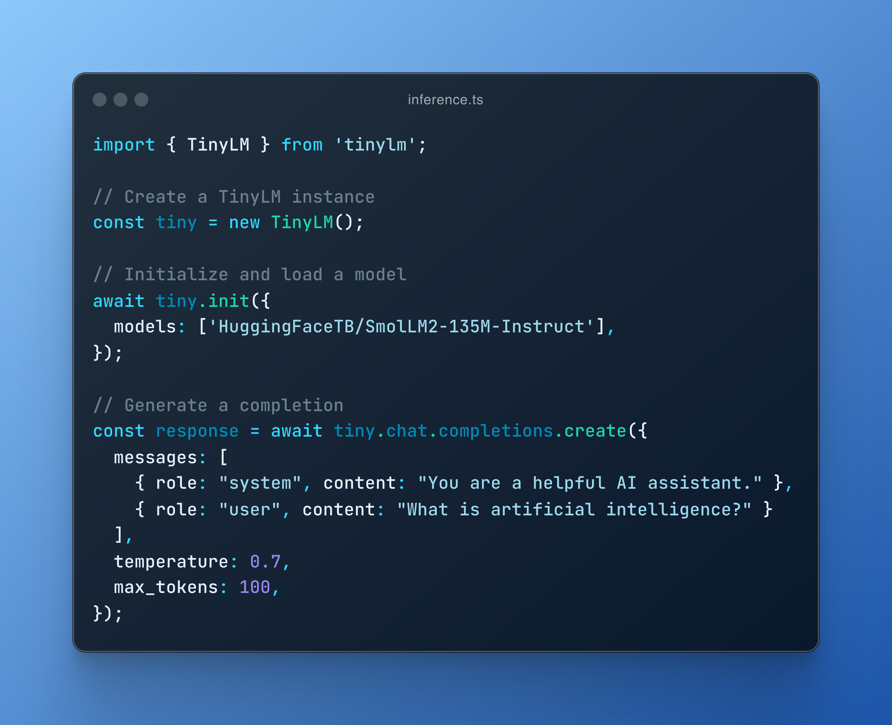

<div align="center">
  <h1> TinyLM </h1>
  <p> Zero-cost OpenAI-compliant inference on the edge </p>
  <p>
    <a href="https://github.com/wizenheimer/byrd/tree/main/backend/docs/api"><strong>Explore the docs »</strong></a>
  </p>
</div>




## Features

- **OpenAI-compatible API** - Simple drop-in alternative for OpenAI client libraries
- **Client-side Infetence** - Run zero-cost inference client side using webgpu
- **WebGPU Acceleration** - Automatic detection and use of WebGPU when available
- **Cross-Platform** - Works in both browser and Node.js environments
- **True Streaming** - Real-time token streaming with low latency
- **Detailed Progress Tracking** - Per-file download tracking with ETA and speed metrics
- **Interruption Support** - Ability to stop generation mid-way
- **Memory Management** - Explicit model offloading for memory efficiency
- **TypeScript Support** - Fully typed API with exported type definitions

## Installation

```bash
npm install tinylm
# or
yarn add tinylm
```

## Basic Usage

### Quick Start

```javascript
import { TinyLM } from "tinylm";

// Create a TinyLM instance
const tiny = new TinyLM();

// Initialize and load a model
await tiny.init({
  models: ["HuggingFaceTB/SmolLM2-135M-Instruct"],
});

// Generate a completion
const response = await tiny.chat.completions.create({
  messages: [
    { role: "system", content: "You are a helpful AI assistant." },
    { role: "user", content: "What is artificial intelligence?" },
  ],
  temperature: 0.7,
  max_tokens: 100,
});

console.log(response.choices[0].message.content);
```

### Streaming Example

```javascript
import { TinyLM } from "tinylm";

const tiny = new TinyLM();
await tiny.init();
await tiny.models.load({ model: "HuggingFaceTB/SmolLM2-135M-Instruct" });

// Generate a streaming response
const stream = await tiny.chat.completions.create({
  messages: [
    { role: "system", content: "You are a creative storyteller." },
    { role: "user", content: "Write a short poem about technology." },
  ],
  temperature: 0.9,
  max_tokens: 200,
  stream: true, // Enable streaming
});

// Process the stream
for await (const chunk of stream) {
  const content = chunk.choices[0]?.delta?.content || "";
  process.stdout.write(content); // Display content as it arrives
}
```

## API Reference

### `TinyLM` Class

#### Constructor

```javascript
const tiny = new TinyLM({
  progressCallback: (progress) => console.log(progress),
  progressThrottleTime: 100,
});
```

Options:

- `progressCallback`: Function called with progress updates
- `progressThrottleTime`: Milliseconds between progress updates (default: 100)

#### `init(options)`

Initialize TinyLM with optional model preloading.

```javascript
await tiny.init({
  models: ["HuggingFaceTB/SmolLM2-135M-Instruct"], // Models to preload
  lazyLoad: true, // Don't load models immediately (default: false)
});
```

#### `chat.completions.create(options)`

Generate text completions with an OpenAI-compatible interface.

```javascript
const response = await tiny.chat.completions.create({
  messages: [
    { role: "system", content: "You are a helpful AI assistant." },
    { role: "user", content: "What is artificial intelligence?" },
  ],
  model: "HuggingFaceTB/SmolLM2-135M-Instruct", // Optional if already loaded
  temperature: 0.7,
  max_tokens: 100,
  do_sample: true,
  top_k: 40,
  top_p: 0.95,
  stream: false, // Set to true for streaming
});
```

Returns:

- When `stream: false`: A completion result object
- When `stream: true`: An async generator yielding completion chunks

#### `models.load(options)`

Load a model for use.

```javascript
await tiny.models.load({
  model: "HuggingFaceTB/SmolLM2-135M-Instruct",
  quantization: "q4f16", // Optional quantization level
});
```

#### `models.offload(options)`

Unload a model to free memory.

```javascript
await tiny.models.offload({
  model: "HuggingFaceTB/SmolLM2-135M-Instruct",
});
```

#### `models.check()`

Check hardware capabilities for WebGPU acceleration.

```javascript
const capabilities = await tiny.models.check();
console.log("WebGPU available:", capabilities.isWebGPUSupported);
console.log("FP16 supported:", capabilities.fp16Supported);
```

#### `models.interrupt()`

Interrupt an ongoing generation.

```javascript
tiny.models.interrupt();
```

#### `models.reset()`

Reset the generation state.

```javascript
tiny.models.reset();
```

## Advanced Examples

### Progress Tracking

```javascript
import { TinyLM } from "tinylm";

// Format bytes to human-readable size
function formatBytes(bytes) {
  if (bytes === 0 || !bytes) return "0 B";
  const sizes = ["B", "KB", "MB", "GB"];
  const i = Math.floor(Math.log(bytes) / Math.log(1024));
  return `${(bytes / Math.pow(1024, i)).toFixed(2)} ${sizes[i]}`;
}

// Create TinyLM with detailed progress tracking
const tiny = new TinyLM({
  progressCallback: (progress) => {
    if (progress.type === "model" && progress.overall) {
      const { bytesLoaded, bytesTotal, percentComplete, speed } =
        progress.overall;
      console.log(
        `Loading model: ${percentComplete}% - ` +
          `${formatBytes(bytesLoaded)}/${formatBytes(bytesTotal)} ` +
          `at ${formatBytes(speed)}/s`
      );

      // Log individual file progress
      if (progress.files && progress.files.length > 0) {
        const activeFiles = progress.files.filter((f) => f.status !== "done");
        if (activeFiles.length > 0) {
          console.log(`Active downloads: ${activeFiles.length}`);
          activeFiles.forEach((file) => {
            console.log(`  ${file.name}: ${file.percentComplete}%`);
          });
        }
      }
    }
  },
});

await tiny.init();
await tiny.models.load({ model: "HuggingFaceTB/SmolLM2-135M-Instruct" });
```

### Interrupting Generation

```javascript
import { TinyLM } from "tinylm";

const tiny = new TinyLM();
await tiny.init();
await tiny.models.load({ model: "HuggingFaceTB/SmolLM2-135M-Instruct" });

console.log("Starting long generation (will interrupt after 3 seconds)...");

// Start generation
const longGeneration = tiny.chat.completions.create({
  messages: [
    { role: "system", content: "You are a detailed technical writer." },
    {
      role: "user",
      content: "Write a detailed guide on machine learning algorithms.",
    },
  ],
  temperature: 0.7,
  max_tokens: 500,
  stream: true,
});

// Set timeout to interrupt generation
setTimeout(() => {
  console.log("\nInterrupting generation...");
  tiny.models.interrupt();
}, 3000);

try {
  for await (const chunk of longGeneration) {
    process.stdout.write(chunk.choices[0]?.delta?.content || "");
  }
} catch (error) {
  console.log("\nGeneration was interrupted:", error.message);
}

// Reset generation state
tiny.models.reset();
```

## TypeScript Support

TinyLM is written in TypeScript and exports all necessary type definitions. Here's an example using TypeScript:

```typescript
import { TinyLM, ProgressUpdate, CompletionChunk } from "tinylm";

// Type guard to check if an object is an AsyncGenerator
function isAsyncGenerator(obj: any): obj is AsyncGenerator<CompletionChunk> {
  return obj && typeof obj[Symbol.asyncIterator] === "function";
}

async function main() {
  const tiny = new TinyLM({
    progressCallback: (progress: ProgressUpdate) => {
      console.log(`[${progress.status}] ${progress.message || ""}`);
    },
  });

  await tiny.init();
  await tiny.models.load({ model: "HuggingFaceTB/SmolLM2-135M-Instruct" });

  const result = await tiny.chat.completions.create({
    messages: [
      { role: "system", content: "You are a helpful assistant." },
      { role: "user", content: "Hello!" },
    ],
    stream: true,
  });

  if (isAsyncGenerator(result)) {
    for await (const chunk of result) {
      process.stdout.write(chunk.choices[0]?.delta?.content || "");
    }
  }
}

main().catch(console.error);
```

## Browser Usage

TinyLM works in browsers without modification. Here's an example using browser APIs:

```html
<!DOCTYPE html>
<html>
  <head>
    <title>TinyLM Browser Demo</title>
  </head>
  <body>
    <div>
      <h2>TinyLM Demo</h2>
      <div id="status">Loading...</div>
      <div id="progress"></div>
      <textarea id="prompt" rows="4" cols="50">
What are large language models?</textarea
      >
      <button id="generate">Generate</button>
      <div id="result"></div>
    </div>

    <script type="module">
      import { TinyLM } from "https://unpkg.com/tinylm/dist/tinylm.esm.js";

      const statusEl = document.getElementById("status");
      const progressEl = document.getElementById("progress");
      const promptEl = document.getElementById("prompt");
      const generateBtn = document.getElementById("generate");
      const resultEl = document.getElementById("result");

      // Create TinyLM instance with progress tracking
      const tiny = new TinyLM({
        progressCallback: (progress) => {
          statusEl.textContent = progress.message || progress.status;
          if (typeof progress.percentComplete === "number") {
            progressEl.textContent = `${progress.percentComplete}%`;
          }
        },
      });

      // Initialize when page loads
      (async function init() {
        statusEl.textContent = "Initializing...";
        await tiny.init();

        // Check WebGPU
        const capabilities = await tiny.models.check();
        statusEl.textContent = `Ready! WebGPU: ${
          capabilities.isWebGPUSupported ? "Available" : "Not available"
        }`;

        // Load model
        generateBtn.addEventListener("click", async () => {
          resultEl.textContent = "Loading model and generating...";

          try {
            // Load model if not already loaded
            if (!tiny.activeModel) {
              await tiny.models.load({
                model: "HuggingFaceTB/SmolLM2-135M-Instruct",
              });
            }

            // Generate completion
            const stream = await tiny.chat.completions.create({
              messages: [
                { role: "system", content: "You are a helpful assistant." },
                { role: "user", content: promptEl.value },
              ],
              stream: true,
            });

            // Display streaming results
            resultEl.textContent = "";
            for await (const chunk of stream) {
              const content = chunk.choices[0]?.delta?.content || "";
              if (content) {
                resultEl.textContent += content;
              }
            }
          } catch (error) {
            resultEl.textContent = `Error: ${error.message}`;
          }
        });
      })();
    </script>
  </body>
</html>
```

## Configuration Options

### WebGPU Configuration

By default, TinyLM will automatically detect WebGPU capabilities and use the optimal configuration. You can override this behavior:

```javascript
const tiny = new TinyLM();
await tiny.init();

// Load model with custom quantization
await tiny.models.load({
  model: "HuggingFaceTB/SmolLM2-135M-Instruct",
  quantization: "q4f16", // Explicit quantization (q4f16, q4, etc.)
});
```

### Generation Parameters

TinyLM supports all Transformers.js generation parameters:

```javascript
const response = await tiny.chat.completions.create({
  messages: [
    { role: "system", content: "You are a helpful assistant." },
    { role: "user", content: "Hello!" },
  ],
  temperature: 0.7, // Controls randomness (0-1)
  max_tokens: 100, // Maximum tokens to generate
  do_sample: true, // Enable sampling
  top_k: 40, // Keep only top k tokens with highest probability
  top_p: 0.95, // Keep tokens with cumulative probability >= top_p
  repetition_penalty: 1.2, // Penalize repetition
  // ... other Transformers.js parameters
});
```

## License

MIT
